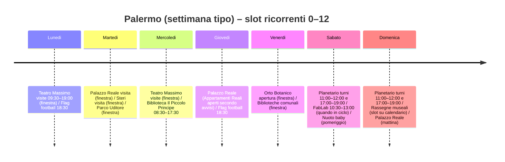

# Attività per bambini e preadolescenti a Palermo (0–12)

## Sintesi esecutiva

Palermo offre un ecosistema molto ricco di attività per 0–12 anni, con due punti di forza: (1) **visite e programmi ricorrenti nei luoghi culturali** (musei, palazzi storici, orto botanico, planetario) e (2) **sport e laboratori strutturati** (nuoto baby, corsi digitali e STEM, club sportivi). Le opzioni davvero “settimanali” e stabili tendono a concentrarsi su: **visite guidate/turni** (teatri e siti monumentali), **programmi del weekend** (planetario, rassegne per famiglie), e **allenamenti/corsi** (sport e STEM).

La copertura per fasce d’età risulta sbilanciata in modo prevedibile:  
- **0–3:** prevalgono attività in acqua/musica, spazi lettura e uscite “lente” (musei/orti/planetario selezionati per età). citeturn7search1turn18view0turn13view0turn21search1  
- **4–7:** è la fascia con più “format” ricorrenti per famiglie (planetario nel weekend, museo-laboratorio, teatro di figura/pupi). citeturn21search1turn6view4turn6view0turn5search13  
- **8–12:** aumentano corsi tecnici (coding/robotica/AI, surf, sport di squadra). citeturn15view1turn16view0turn22view0turn22view1  

## Metodologia e fonti prioritari

La raccolta è stata costruita privilegiando:  
1) i due portali locali richiesti (palermobimbi.it e balarm.it) per l’individuazione di **categorie, sedi e contatti** e per intercettare iniziative “famiglie”; citeturn7search9turn19search9turn19search10  
2) i siti ufficiali di teatri, musei, parchi e istituzioni per **orari, prezzi, accessibilità e prenotazioni**; citeturn9view0turn21search1turn23view1turn20search8turn6view2  
3) portali pubblici (Comune/Palermo Welcome, portale biblioteche) per **indirizzi e contatti “di sistema”**. citeturn13view0turn13view1turn20search2turn20search8  

Dove un’informazione non è reperibile in modo affidabile (es. cadenze interne variabili, prezzi “a pacchetto”, note su barriere), è riportata come **non specificato**.

## Programmi ricorrenti con dettagli operativi

### Tabella comparativa per fascia d’età

| 0–3 | 4–7 | 8–12 |
|---|---|---|
| Nuoto baby (3–36 mesi) – sabato (pomeriggio) | Planetario (5–10) – sabato/domenica (turni) | FabLab digitale (coding/robotica/AI) – sabato mattina (cicli) |
| “Musica in fasce” (3–36 mesi) – cadenza non specificata | Mini museo hands-on (eventi frequenti) – vari giorni/orari | CoderDojo (coding/tinkering) – cadenza non specificata |
| Biblioteche con area 0–6 e letture/eventi (variabili) | Opera dei Pupi / teatro di figura – turni fissi (mattina/pomeriggio) | Flag football – lunedì e giovedì (18:30) |
| Parchi custoditi/attrezzati (uscite libere) | “Tutte le storie portano al museo” – weekend (slot) | Surf kids (4–9; per 8–12 in particolare) – lezioni (1h) |

image_group{"layout":"carousel","aspect_ratio":"16:9","query":["Teatro Massimo Palermo visita guidata","Planetario Villa Filippina Palermo cupola","Orto Botanico Palermo ingresso","Museo delle Marionette Antonio Pasqualino Palermo teatrino dei pupi"],"num_per_query":1}

### Schede dei programmi

**Attività:** entity["point_of_interest","Teatro Massimo","opera house, palermo, it"] – visite guidate (standard)  
Organizzatore: entity["organization","Fondazione Teatro Massimo di Palermo","performing arts foundation, palermo"]  
Categoria: visita guidata / teatro (dietro le quinte disponibile)  
Età: 0–12 (bambini <6 gratis; contenuti adatti anche in famiglia)  
Ricorrenza: **tutti i giorni**, 9:30–19:00 (ultima visita 18:20)  
Luogo: Piazza Verdi, 90138 Palermo  
Costo: €12 intero; €6 under 26; “Speciale Famiglie” €30 (2 adulti + 2 under26); **gratis <6**; backstage +€5 (su accordo)  
Prenotazioni/contatti: acquisto in biglietteria o online; gruppi su richiesta; tel. 091 6053267; email visiteguidate@teatromassimo.it  
Accessibilità: visita standard indicata come accessibile; modelli 3D e mappe tattili per persone non vedenti/ipovedenti; backstage **parzialmente** accessibile  
Descrizione: tour breve (circa 40 minuti) degli spazi principali, adatto come “ancoraggio” culturale per famiglie con bambini piccoli e preadolescenti. citeturn9view0  

**Attività:** entity["point_of_interest","Planetario di Palermo","planetarium, palermo, it"] (Museo della Terra e dello Spazio) – spettacoli e visita museo  
Organizzatore: gestione e segreteria indicata dal planetario (contatti diretti)  
Categoria: scienza / astronomia (spettacolo sotto cupola + museo)  
Età: indicato ridotto 5–10; per 0–4 non specificato (valutare caso per caso)  
Ricorrenza: **sabato e domenica** (gennaio/febbraio 2026: 11:00, 12:00, 17:00, 18:00, 19:00; scuole lun–ven 9:00–11:00 e 15:00–17:00 su prenotazione)  
Luogo: Piazza San Francesco di Paola, 18, Palermo  
Costo: €10 intero; €5 (5–10 anni); supplemento laboratori €4 (quando previsti)  
Prenotazioni/contatti: planetariopalermo@gmail.com; tel. segreteria 389 1335731; scuole 347 5374646  
Accessibilità: non specificato  
Descrizione: format chiaro e ripetibile nel weekend, utile per creare un’abitudine (scienza + narrazione) soprattutto 5–12 anni. citeturn21search1  

**Attività:** entity["point_of_interest","Parco Villa Filippina","urban park, palermo, it"] – parco + area bimbi/servizi (uscita libera)  
Organizzatore: gestione parco (contatti via Palermo Welcome)  
Categoria: outdoor urbano / spazio gioco (con offerta eventi variabile)  
Età: 0–12  
Ricorrenza: accesso al parco indicato come **tutti i giorni** (orari lun–ven 10:00–20:00; sab–dom 10:00–24:00)  
Luogo: Piazza San Francesco di Paola, 18, Palermo  
Costo: ingresso parco indicato come gratuito  
Prenotazioni/contatti: parcovillafilippina@gmail.com (altro non specificato)  
Accessibilità: non specificato  
Descrizione: parco “hub” perché integra verde, servizi e programmazione variabile (quando presente). citeturn21search10  

**Attività:** entity["point_of_interest","MiniMuPa Hands on Museum","children museum, palermo, it"] – mini museo interattivo (hands-on)  
Organizzatore: MiniMuPa  
Categoria: museo interattivo / laboratori / eventi  
Età: prevalentemente 4–12 (per scuole/famiglie; dettagli per singolo evento)  
Ricorrenza: calendario eventi continuo (cadenza non fissa; es. eventi con orari 10:30–13:00 o 10:00–19:00)  
Luogo: Vicolo San Carlo, 32–34, Palermo (sede museo); alcune attività in sedi partner (specificate per evento)  
Costo: variabile (per evento; spesso con acquisto online)  
Prenotazioni/contatti: tel. +39 389 461 8373; segreteria@minimupa.it  
Accessibilità: non specificato  
Descrizione: è l’opzione più “laboratoriale” e modulabile per 6–12, con eventi tematici (cacce al tesoro, tradizioni locali, notti al museo in sedi partner). citeturn6view3turn6view4  

**Attività:** “Tutte le storie portano al Museo” (VIII edizione) – visite-gioco e laboratori per famiglie  
Organizzatore: entity["organization","CoopCulture","cultural services coop, italy"]  
Categoria: visite-gioco / laboratori (arte, archeologia, botanica, zoologia)  
Età: tipicamente 3–10 (con attività spesso 6–10; dipende dal singolo appuntamento)  
Ricorrenza: format del weekend; comunicato come **sabato e domenica** con slot (es. 11:00 e 16:00) su calendario stagionale  
Luogo: sedi varie (es. Orto Botanico, Museo Riso, ecc.; indicate per evento)  
Costo: variabile (esempi “10 euro” su alcuni weekend; altri prezzi per iniziative speciali)  
Prenotazioni/contatti: acquisto biglietti e info su pagine dedicate; call center/contatti variabili (non specificato un unico recapito)  
Accessibilità: dipende dal sito ospitante (vedi schede di Orto Botanico/Steri/Palazzo, quando coinvolti)  
Descrizione: rassegna ad alta “densità didattica” con appuntamenti ripetuti nel tempo, utile per costruire una routine culturale nel weekend. citeturn19search5turn19search9turn6view0  

**Attività:** entity["point_of_interest","Orto Botanico di Palermo","botanical garden, palermo, it"] – visita libera + didattica (su prenotazione)  
Organizzatore: Sistema Museale UNIPA / servizi didattici indicati  
Categoria: natura / museo scientifico / visite e percorsi didattici  
Età: 0–12 (percorsi didattici calibrati per scuole; famiglie ok)  
Ricorrenza: apertura **tutti i giorni** (orario differenziato per stagioni); didattica su prenotazione  
Luogo: Via Lincoln, 2, 90133 Palermo  
Costo: biglietto ordinario €10; ridotto €5; **family pass €18**; gratuito <6 e gratuito per persone con disabilità + accompagnatore  
Prenotazioni/contatti: didattica e visite guidate: didattica.musei@unipa.it; tel. 351 8901094  
Accessibilità: previste gratuità e indicazioni “per disabilità” (come sopra); barriere/percorsi interni non dettagliati  
Descrizione: uscita altamente flessibile (da 60 minuti a mezza giornata), utile come base per laboratori naturalistici e osservazione guidata. citeturn6view2  

**Attività:** entity["point_of_interest","Steri - Palazzo Chiaromonte","historic palace, palermo, it"] – visita accompagnata  
Organizzatore: CoopCulture / Sistema museale (contatti dedicati)  
Categoria: visita guidata / sito storico-universitario  
Età: 6–12 (0–5 possibile ma dipende dal gruppo; non specificato)  
Ricorrenza: **tutti i giorni** con visite accompagnate (9:00–20:00 dal 1 marzo al 31 ottobre; 9:00–18:00 dal 1 novembre al 28 febbraio)  
Luogo: (indirizzo non specificato nella scheda CoopCulture; riferimento “Palazzo Steri” in città)  
Costo: €8 intero; €5 ridotto; combinati disponibili (es. Salinas + Orto Botanico + Doderlein €13)  
Prenotazioni/contatti: prenotazione scrivendo a sistemamuseale@unipa.it; per biglietteria anche biglietteria.steri@coopculture.it (contatto Comune)  
Accessibilità: indicato “accessibile”; audioguida scaricabile  
Descrizione: visita storica “a bassa frizione” (orari larghi, accompagnamento), utile come tappa dentro un itinerario a piedi centro storico/Kalsa. citeturn19search2turn19search8turn19search30  

**Attività:** entity["point_of_interest","Museo Archeologico Regionale Antonino Salinas","archaeological museum, palermo, it"] – visite in calendario + didattica  
Organizzatore: CoopCulture (gestione servizi e biglietteria indicata)  
Categoria: museo / archeologia / visite e didattica  
Età: 6–12 (contenuti family e scuole; dipende dal format)  
Ricorrenza: visite per singoli “in calendario”; gruppi e scuole su prenotazione  
Luogo: (indirizzo non specificato nella scheda CoopCulture; sede museo in centro città)  
Costo: biglietto €8 intero (riduzioni/gratuità secondo normativa; combinati disponibili)  
Prenotazioni/contatti: gruppi: tour@coopculture.it; scuole: edu@coopculture.it  
Accessibilità: non specificato  
Descrizione: uno dei poli più usati per visite-gioco e domeniche tematiche per famiglie, quando in programmazione. citeturn19search0turn19search32  

**Attività:** entity["point_of_interest","RISO - Museo d’Arte Moderna e Contemporanea della Sicilia","modern art museum, palermo"] – visita museo (con possibili attività famiglie)  
Organizzatore: CoopCulture (biglietteria online)  
Categoria: museo / arte contemporanea  
Età: 6–12 (quando presenti format famiglie; non specificato in modo stabile)  
Ricorrenza: visita museo (orari non specificati qui); attività dipendono dal calendario  
Luogo: Palazzo Riso (indirizzo non specificato nella scheda prodotto)  
Costo: €8 intero; €4 ridotto; gratuità secondo normativa  
Prenotazioni/contatti: acquisto online tramite CoopCulture (dettagli su pagina biglietti)  
Accessibilità: non specificato  
Descrizione: buona opzione per introdurre arte contemporanea 8–12 se agganciata a visite-gioco/laboratori. citeturn19search24  

**Attività:** entity["point_of_interest","Museo Internazionale delle Marionette Antonio Pasqualino","puppet museum, palermo, it"] – spettacoli di Opera dei Pupi (Teatrino dei Pupi Siciliani)  
Organizzatore: Museo delle Marionette  
Categoria: teatro per famiglie / tradizione (pupi)  
Età: 4–12 (0–3 possibile solo se gestibile in sala; non specificato)  
Ricorrenza: turni indicati come **settimanali fissi** (es. lunedì 11:00; mart–sabato 17:00)  
Luogo: Piazzetta Antonio Pasqualino, 5, Palermo  
Costo: non specificato  
Prenotazioni/contatti: mimap@museomarionettepalermo.it; tel. 091 328060  
Accessibilità: non specificato  
Descrizione: esperienza ad alto impatto per 4–12 perché unisce storia, ritmo e artigianato scenico; utile anche come primo teatro “serio” per bambini. citeturn9view3  

**Attività:** Stagione spettacoli (rassegne 2026) al Museo delle Marionette – appuntamenti del weekend  
Organizzatore: Museo delle Marionette  
Categoria: teatro ragazzi / rassegne  
Età: non specificato (orientato a famiglie)  
Ricorrenza: cicli stagionali; esempi 2026: “Orlando Furioso fatto a pezzi” **sabato** 16:30 (feb–mag) e “Le mille e una donna” **domenica** 12:00 (feb–giu)  
Luogo: Piazzetta Antonio Pasqualino, 5, Palermo  
Costo: non specificato  
Prenotazioni/contatti: info@museomarionettepalermo.it (contatto generale indicato)  
Accessibilità: non specificato  
Descrizione: utile per pianificare il weekend con un’ora “fissa” e ripetibile (sabato pomeriggio / domenica a pranzo). citeturn3view2  

**Attività:** entity["point_of_interest","Palazzo Reale di Palermo","palazzo dei normanni, palermo"] – visita monumentale  
Organizzatore: entity["organization","Fondazione Federico II","cultural foundation, palermo"] / ARS (informazioni istituzionali)  
Categoria: visita storica / patrimonio UNESCO  
Età: 0–12 (gratuità bambini fino a 13 anni se accompagnati; “Meta Experience” ridotto 0–13)  
Ricorrenza: aperto tutti i giorni; **orari distinti** (lun–sab ultimo ingresso 16:30; domenica/festivi ultimo ingresso 12:30); attenzioni per funzioni religiose (chiusure parziali Cappella la domenica 9:30–11:30, e variazioni per motivi istituzionali/religiosi)  
Luogo: ingresso in Piazza del Parlamento; uffici Fondazione: Piazza della Vittoria, 23, 90134 Palermo  
Costo: variabile per giorni/aree: esempi €19 (gio–lun e festivi, visita completa); €15,50 (mar–mer, Appartamenti Reali non visitabili); “Meta Experience” €3 (ridotto 0–13 €2); audioguida €5  
Prenotazioni/contatti: biglietteria online; “visite riservate” e tour operator: tel. 334 6395860; mail claudio.picciurro@federicosecondo.org; contatto generale fondazione@federicosecondo.org  
Accessibilità: sezioni accessibili elencate (Cappella Palatina, Sala d’Ercole, Giardini Reali ecc.); aree non accessibili indicate (es. Mura Puniche, Sala Re Ruggero, Torre Pisana)  
Descrizione: è il sito storico “ad alta resa” per famiglie; per 0–6 conviene trattarlo come visita breve con obiettivo singolo (Cappella/giardino), per 8–12 come visita strutturata. citeturn23view0turn23view1  

**Attività:** entity["point_of_interest","Biblioteca comunale dei bambini e dei ragazzi “Il Piccolo Principe”","children library, palermo, it"] – frequentazione libera + visite guidate scuole  
Organizzatore: Sistema Bibliotecario Cittadino (Comune di Palermo)  
Categoria: lettura / biblioteca / spazio 0–6 e ragazzi  
Età: 0–12 (testi e spazi 0–6 e prestito per ragazzi; consultazione ampia)  
Ricorrenza: **lun–ven** 8:30–17:30  
Luogo: Cortile Scalilla, 37 (zona Capo; traversa di via Sant’Agostino), Palermo  
Costo: gratuito (tessera annuale gratuita indicata per accesso)  
Prenotazioni/contatti: tel. 0917408870/71 – 0917408898; email bibliotechearchiviospazietno@comune.palermo.it  
Accessibilità: non specificato; presenza di libri LIS e materiali per bisogni speciali descritta  
Descrizione: presidio stabile per 0–12: spazio “sicuro” per lettura, prestito e prime esplorazioni autonome (soprattutto 8–12). citeturn13view0  

**Attività:** entity["point_of_interest","Biblioteca comunale di Brancaccio","public library, palermo, it"] – biblioteca di quartiere + eventi (es. Nati per Leggere)  
Organizzatore: Comune di Palermo (Sistema Bibliotecario)  
Categoria: biblioteca / lettura / eventi per famiglie  
Età: 0–12 (sezione ragazzi; eventi variabili)  
Ricorrenza: orari misti (lun/mar/gio/ven 8:30–13:30 + alcuni lun e mer del mese con fascia pomeridiana)  
Luogo: Via San Ciro, 19, 90124 Palermo  
Costo: accesso biblioteca gratuito; eventi variabili (non specificato)  
Prenotazioni/contatti: tel. 091 6306842; email bibliotechearchiviospazietno@comune.palermo.it  
Accessibilità: non specificato  
Descrizione: utile per agganciare format di lettura “0–6” quando attivi (es. eventi Nati per Leggere) e come routine di quartiere. citeturn13view1turn12view0  

**Attività:** entity["point_of_interest","BOOQ - Bibliofficina di quartiere","community library, palermo, it"] – biblioteca/centro di comunità  
Organizzatore: BOOQ  
Categoria: lettura / comunità / attività culturali (variabili)  
Età: 0–12 (attività specifiche non dettagliate qui)  
Ricorrenza: lun/mer/ven 9:00–13:00; mar/gio 9:00–18:00  
Luogo: Via Santa Teresa, Palermo  
Costo: non specificato (accesso tipicamente libero; qui non specificato)  
Prenotazioni/contatti: tel. 091 929 47 85; email info@booqpa.org  
Accessibilità: non specificato  
Descrizione: spazio “ibrido” utile quando si cercano attività inclusive e di prossimità, oltre alla biblioteca tradizionale. citeturn13view2  

**Attività:** entity["local_business","Libreria Dudi","children bookshop, palermo, it"] – letture e laboratori (programmazione variabile)  
Organizzatore: Libreria Dudi  
Categoria: lettura / workshop creativi  
Età: 0–12 (libreria 0–16; attività per fasce)  
Ricorrenza: non specificato (indicato “programma di attività variegato”; calendario pubblicato sui canali della libreria)  
Luogo: Via Quintino Sella, 71, Palermo  
Costo: non specificato  
Prenotazioni/contatti: info@libreriadudi.com; tel. +39 333 6330044  
Accessibilità: non specificato  
Descrizione: nodo centrale della cultura per l’infanzia in città; utile come “radar” per laboratori di qualità e presentazioni. citeturn10view1  

**Attività:** entity["local_business","Libreria Tante Storie","children bookshop, palermo, it"] – letture e incontri  
Organizzatore: Libreria Tante Storie  
Categoria: lettura / incontri / eventi  
Età: 0–12 (fino a 16 indicato dalla scheda)  
Ricorrenza: non specificato (“organizza letture… incontri con autori…”)  
Luogo: Via Ludovico Ariosto 27 A/B, 90144 Palermo  
Costo: non specificato  
Prenotazioni/contatti: libreriatantestorie@alice.it; tel. 091-6269617  
Accessibilità: non specificato  
Descrizione: alternativa solida a Dudi per letture e incontri, con focus libreria indipendente. citeturn10view1  

**Attività:** entity["organization","FabLab Palermo","makerspace aps, palermo"] – Laboratori Digitali (coding/robotica/AI)  
Organizzatore: FabLab Palermo APS  
Categoria: workshop STEM / coding / robotica / AI  
Età: non specificato nella pagina (target “bambine e bambini”; in pratica 8–12 è la fascia più coerente)  
Ricorrenza: **cicli** di incontri (es. 4 sabati per coding: 7–21–28 febbraio + 7 marzo 2026, 10:30–13:00; robotica: 14–28 marzo + 11–18 aprile 2026; AI: 9–16–23 maggio 2026)  
Luogo: Via Titina De Filippo, 3, Palermo  
Costo: €120 (iscritti) / €150 (nuovi iscritti) per singolo laboratorio; pacchetto completo €300/€350  
Prenotazioni/contatti: corsistica@fablabpalermo.org; tel/WhatsApp 392 7657855; prenotazione via form  
Accessibilità: non specificato  
Descrizione: è la proposta più “curricolare” e misurabile per 8–12, con output concreti (storie/gioco, robot, concetti base AI). citeturn15view1  

**Attività:** entity["organization","CoderDojo Palermo","coding club, palermo"] – laboratori di pensiero computazionale (scuole e progetti)  
Organizzatore: CoderDojo Palermo  
Categoria: coding / tinkering / educazione digitale  
Età: tipicamente primaria e secondaria di primo grado (coerente con 8–12)  
Ricorrenza: non specificato (attività per progetti, spesso in collaborazione con scuole e iniziative)  
Luogo: sedi variabili in base al progetto (indirizzo non specificato)  
Costo: non specificato (spesso gratuito in progetti; qui non specificato)  
Prenotazioni/contatti: coderdojo.palermo@gmail.com  
Accessibilità: non specificato  
Descrizione: adatto 8–12 quando si attivano moduli su Scratch e tinkering (Makey Makey), con progressione verso Arduino. citeturn16view0  

**Attività:** entity["organization","Istituto Carl Rogers","early childhood school, palermo"] – laboratori (musica in fasce; cucina, ecc.)  
Organizzatore: Istituto Carl Rogers  
Categoria: musica 0–3 / laboratori esperienziali  
Età: “Musica in fasce” 3–36 mesi; altri laboratori non specificati per età  
Ricorrenza: non specificato (attività nell’anno scolastico)  
Luogo: Via Caravaggio, 9/11, Palermo  
Costo: non specificato  
Prenotazioni/contatti: tel. 091 5081368  
Accessibilità: non specificato  
Descrizione: opzione privata utile per 0–3 se si cerca un percorso “regolare” in piccolo gruppo (da verificare calendario e iscrizioni). citeturn18view0  

**Attività:** entity["local_business","Body Studio Emilia","gym and pool, palermo"] – nuoto baby (genitore+bimbo)  
Organizzatore: Body Studio Emilia  
Categoria: sport / acquaticità / 0–3  
Età: 3–36 mesi  
Ricorrenza: **ogni sabato pomeriggio** (come indicato)  
Luogo: Via Emilia, 21, 90144 Palermo  
Costo: non specificato  
Prenotazioni/contatti: tel. +39 091 273 6470; emilia@palestrebodystudio.it  
Accessibilità: non specificato  
Descrizione: opzione ricorrente e chiara per 0–3, utile per routine e sviluppo motorio in acqua. citeturn7search1  

**Attività:** entity["local_business","Virgin Active","fitness club, palermo"] – scuola nuoto bimbi  
Organizzatore: Virgin Active  
Categoria: sport / nuoto  
Età: 3–14 (quindi 3–12 inclusi)  
Ricorrenza: non specificato (scuola nuoto con livelli)  
Luogo: Via Ventura Gioacchino 11, 90143 Palermo  
Costo: non specificato  
Prenotazioni/contatti: tramite sito Virgin Active (contatti non specificati qui)  
Accessibilità: non specificato  
Descrizione: opzione “standardizzata” per imparare e progredire a livelli, utile dai 4 anni in su. citeturn7search5  

**Attività:** entity["sports_team","Sharks Football ASD","flag football club, palermo"] – flag football (giovanili)  
Organizzatore: Sharks Football ASD  
Categoria: sport di squadra  
Età: da circa 9/10 anni in su (con Under 13 indicata)  
Ricorrenza: **lunedì e giovedì** alle 18:30 (allenamenti)  
Luogo: sede: Via Arrigo Boito, 14, 90145 Palermo; allenamenti: Istituto Salesiano Don Bosco Ranchibile (Via Libertà)  
Costo: non specificato  
Prenotazioni/contatti: segreteria@sharkspalermofootball.com; referenti e numeri in scheda; sito ufficiale indicato  
Accessibilità: non specificato  
Descrizione: sport di squadra senza contatto (flag) adatto 8–12 per coordinazione e socialità; format allenamenti serali compatibile con scuola. citeturn22view1  

**Attività:** entity["organization","Isola Surf School & Club","surf school, isola delle femmine"] – corso bimbi  
Organizzatore: Isola Surf  
Categoria: sport outdoor / mare  
Età: 4–9 (dichiarata); per 8–12 valutare livello e condizioni mare  
Ricorrenza: lezioni (cadenza non specificata; stagione/onde influenzano)  
Luogo: Lido Miramare, 90040 Isola delle Femmine (PA)  
Costo: privato €160; gruppo 2 €110; gruppo 3–5 €80 (come riportato)  
Prenotazioni/contatti: tel. 320 6826192; info@isolasurf.com  
Accessibilità: non specificato  
Descrizione: opzione sportiva “forte” per bambini che amano mare e equilibrio; richiede logistica fuori città e condizioni meteo-marine. citeturn22view0  

**Attività:** entity["organization","Surfpalermo","surf school, isola delle femmine"] – lezioni e noleggio  
Organizzatore: Surfpalermo  
Categoria: sport outdoor / mare  
Età: non specificato  
Ricorrenza: lezioni di circa 1 ora (cadenza non specificata)  
Luogo: c/o Lido dei Carabinieri, Viale dei Saraceni 32, 90040 Isola delle Femmine (PA)  
Costo: non specificato  
Prenotazioni/contatti: info@surfpalermo.it; tel. +39 3318017241 / +39 3315395300  
Accessibilità: non specificato  
Descrizione: alternativa per surf con impostazione anche “itinerante” su più spot. citeturn22view0  

**Attività:** entity["organization","Rugby Tots","youth rugby programme, italy"] – motricità con palla ovale (no contatto)  
Organizzatore: RugbyTots (programma)  
Categoria: sport / motricità di base  
Età: 2–7  
Ricorrenza: non specificato  
Luogo: non specificato  
Costo: non specificato  
Prenotazioni/contatti: palermo@rugbytots.it; tel. 371 3452708  
Accessibilità: non specificato  
Descrizione: opzione adatta 2–7 se si cerca motricità in gruppo con struttura “gioco + regole” senza contatto. citeturn22view2  

**Attività:** entity["organization","Playhouse","kids creative space, palermo"] – laboratori creativi (arte/musica/scacchi/scienza)  
Organizzatore: Playhouse / Playschool  
Categoria: laboratori e doposcuola creativo  
Età: 5–13  
Ricorrenza: non specificato  
Luogo: Viale delle Alpi, 75, 90144 Palermo  
Costo: non specificato  
Prenotazioni/contatti: info@scuolaplayschool.it; tel. +39 351 6274161  
Accessibilità: non specificato  
Descrizione: proposta “generalista” ma utile per 5–12 quando si vuole alternare creativo e logico (scacchi/scienza) in un unico luogo. citeturn7search18  

**Attività:** entity["point_of_interest","Parco Uditore","urban park, palermo, it"] – parco con area gioco e attività (uscita libera)  
Organizzatore: gestione parco (contatti pubblici)  
Categoria: outdoor urbano / playground  
Età: 0–12  
Ricorrenza: apertura indicata con orari stagionali (mar–sab 7:00 fino al tramonto; dom 8:00–18:00; lun chiuso)  
Luogo: (indirizzo non specificato nella scheda Palermo Welcome; contatti email/sito presenti)  
Costo: gratuito (non specificato ma parco pubblico)  
Prenotazioni/contatti: info@parcouditore.org; sito parcouditore.org  
Accessibilità: non specificato; presenza di percorsi ciclo-pedonali e area gioco riportata  
Descrizione: scelta robusta per uscite quotidiane e weekend; utile come “default park” con area gioco e spazi fitness. citeturn20search8turn20search28  

## Eventi one-off e festival stagionali

**Attività:** Nati per Leggere Sicilia – “piccole storie” (evento)  
Organizzatore: Nati per Leggere Sicilia (in collaborazione con biblioteca ospitante; non specificato nella scheda)  
Categoria: lettura ad alta voce / famiglie  
Età: 0–6 (indicato)  
Ricorrenza: one-off (esempio rilevato: 23 marzo 2026, 16:00–17:30)  
Luogo: Biblioteca comunale di Brancaccio, Via San Ciro 19, Palermo  
Costo: non specificato  
Prenotazioni/contatti: tel. 091 6306842  
Accessibilità: non specificato  
Descrizione: format breve e “pronto” per 0–6; importante perché intercetta famiglie non già dentro librerie private. citeturn12view0  

**Attività:** “Visite-gioco e laboratori creativi” (weekend) – esempi su Museo Riso/Orto Botanico  
Organizzatore: CoopCulture  
Categoria: visite-gioco / laboratorio  
Età: 6–10 (indicato per il weekend citato)  
Ricorrenza: one-off con appuntamenti ripetuti nel calendario (non settimanale fisso)  
Luogo: sedi indicate per evento (esempio: Museo Riso e Orto Botanico)  
Costo: esempio €10 (per weekend specifico)  
Prenotazioni/contatti: info e biglietti su pagina dedicata CoopCulture (non specificato un recapito unico)  
Accessibilità: dipende dal luogo ospitante  
Descrizione: utile per “riempire” sabato/domenica con un format da 60–90 minuti, senza dover inventare attività. citeturn19search9  

**Attività:** Calendario eventi di MiniMuPa (esempi: cacce al tesoro, Pasquetta, notti al museo)  
Organizzatore: MiniMuPa  
Categoria: laboratorio / gioco / evento speciale  
Età: variabile (specificata per evento)  
Ricorrenza: one-off frequenti; elenco “Prossimi eventi” aggiornato  
Luogo: sedi diverse (es. Minimupa Garden; Museo Gemmellaro come partner in alcuni eventi)  
Costo: variabile (spesso con acquisto)  
Prenotazioni/contatti: come da scheda MiniMuPa (tel/email)  
Accessibilità: non specificato  
Descrizione: canale utile quando si cerca attività “pronte” con orari chiari e acquisto immediato. citeturn6view4turn6view3  

Per intercettare **festival e speciali** (carnevale, pasqua, prime domeniche del mese, rassegne, spettacoli singoli) con aggiornamento continuo, la strategia migliore è usare due “radar”: palermobimbi.it (sezioni Eventi e categorie: teatri, parchi gioco, ludoteche, corsi) e balarm.it (sezione “laboratori e attività per bambini” e “visite/itinerari/escursioni”). citeturn7search9turn19search9  

## Spazi gioco, natura e attività outdoor

image_group{"layout":"carousel","aspect_ratio":"16:9","query":["Parco Uditore Palermo area giochi","Parco della Salute Foro Italico Palermo","Città dei Ragazzi Palermo parco","Eden Parco Giochi Palermo"],"num_per_query":1}

**Attività:** entity["point_of_interest","Parco della Salute","foro italico park, palermo"] – parco attrezzato (uscita libera)  
Organizzatore: gestione associativa (Vivi Sano; progetto e mission riportati)  
Categoria: outdoor urbano / sport e gioco (parco “senza barriere” come mission)  
Età: 0–12  
Ricorrenza: apertura/orari non specificati qui (consultare canali ufficiali)  
Luogo: area Foro Italico (indirizzo non specificato nella fonte qui)  
Costo: non specificato (parco pubblico; qui non specificato)  
Prenotazioni/contatti: non specificato  
Accessibilità: dichiarata come obiettivo centrale (“parco pubblico senza barriere”)  
Descrizione: utile come uscita funzionale (gioco + movimento) soprattutto se serve un contesto più controllato rispetto a spazi non custoditi. citeturn20search5  

**Attività:** entity["point_of_interest","Città dei Ragazzi","family park, palermo, it"] – spazio ludico educativo  
Organizzatore: entity["organization","Le Vie dei Tesori","cultural org, palermo"] (ente gestore indicato nel portale turistico)  
Categoria: parco / attività per bambini (spazio dedicato)  
Età: 0–12  
Ricorrenza: stato indicato come “temporaneamente chiuso” nel portale (verificare prima di andare)  
Luogo: Viale degli Abruzzi, 1, 90146 Palermo  
Costo: non specificato  
Prenotazioni/contatti: tel. 0916714373; segreteria@leviedeitesori.it (ente gestore)  
Accessibilità: non specificato  
Descrizione: quando operativo, è uno dei pochi spazi progettati specificamente per lo svago dei bambini all’interno di un grande polmone verde. citeturn20search2  

**Attività:** entity["local_business","Eden Parco Giochi","amusement park, palermo"] – parco giochi/giostre indoor-outdoor  
Organizzatore: Eden Parco Giochi  
Categoria: amusement / giostre  
Età: 0–12 (attrazioni differenziate; non specificato)  
Ricorrenza: aperto quasi tutto l’anno (chiuso il martedì; fasce orarie diverse feriali/sabato/domenica)  
Luogo: non specificato nella pagina “ingresso” consultata  
Costo: non specificato (dipende da attrazioni; non indicato qui)  
Prenotazioni/contatti: non specificato  
Accessibilità: non specificato  
Descrizione: opzione “meteo-proof” per tardo pomeriggio/sera, con orari estesi nei weekend. citeturn20search15  

**Attività:** Parco giochi presso Parrocchia Maria SS. di Pompei (Bonagia)  
Organizzatore: parrocchia (non specificato)  
Categoria: playground di prossimità  
Età: 0–12  
Ricorrenza: apertura indicata per 4 pomeriggi a settimana (15:30–18:00) + sabato/domenica mattina (9:00–13:00)  
Luogo: Via Papa Giovanni XXIII, 1, 90125 Palermo  
Costo: gratuito (non specificato; area giochi parrocchiale)  
Prenotazioni/contatti: non specificato  
Accessibilità: non specificato  
Descrizione: utile come opzione di quartiere con finestre orarie relativamente definite. citeturn20search3  

## Vista calendario settimanale dei programmi ricorrenti

map